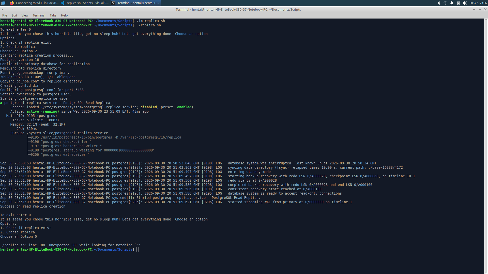
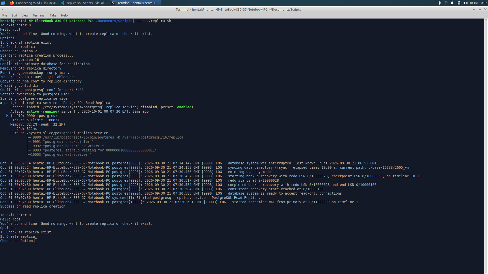

# PostgreSQL Read Replica Automation Script

An interactive Bash automation script designed to simplify the creation, configuration, and lifecycle management of a PostgreSQL read-replica on Debian-Based OS Linux (if on mac well, if on fedora, arch cry.).

---

## Why a Read Replica?

Running a PostgreSQL read replica alongside your primary database provides several key production and development benefits:
- **Load Offloading:** Route heavy analytical queries, reporting, and read-heavy application traffic to port `5433`, leaving your primary database free to handle writes and transactions.
- **High Availability & Scalability:** Easily scale your application architecture horizontally by adding read nodes.
- **Disaster Recovery:** Maintain an active, real-time streaming copy of your primary data directory that can be promoted if the primary node fails.

---

##  What the Script Automates

Instead of configuring replication manually step-by-step, `replica.sh` handles everything dynamically:
1. **Version Detection:** Automatically detects your installed PostgreSQL version (e.g., PostgreSQL 16).
2. **Primary Configuration:** Updates your primary cluster's `postgresql.conf` (`wal_level = replica`, max senders, wal keep size) and restarts the primary service.
3. **Safe Cleanup:** Automatically stops and purges old replica directories to ensure a clean slate on every run.
4. **Stream Backup (`pg_basebackup`):** Securely clones the primary cluster over local Unix sockets using peer authentication (bypassing password prompts).
5. **Config Injection:** Copies essential security configurations (`pg_hba.conf`) and safely appends replica parameters (`port = 5433`, `listen_addresses`, `hot_standby = on`).
6. **Systemd Service Management:** Registers, enables, and manages the replica as a dedicated background system service (`postgresql-replica.service`).

---

## What's needed. (You need to be on root user sudo :)

- **Superuser (`sudo`) privileges** (required to manage systemd services, inspect strict `700` permission directories, and run backups as the `postgres` user).
- PostgreSQL installed and running locally as the primary database.

---

## How to Use

1. **Clone** in your scripts directory.
2. **Make the script executable:**
   ```bash
   chmod +x replica.sh

   sudo ./replica.sh

Sit, relax, sip coffee as magic happens.


## Screenshots



